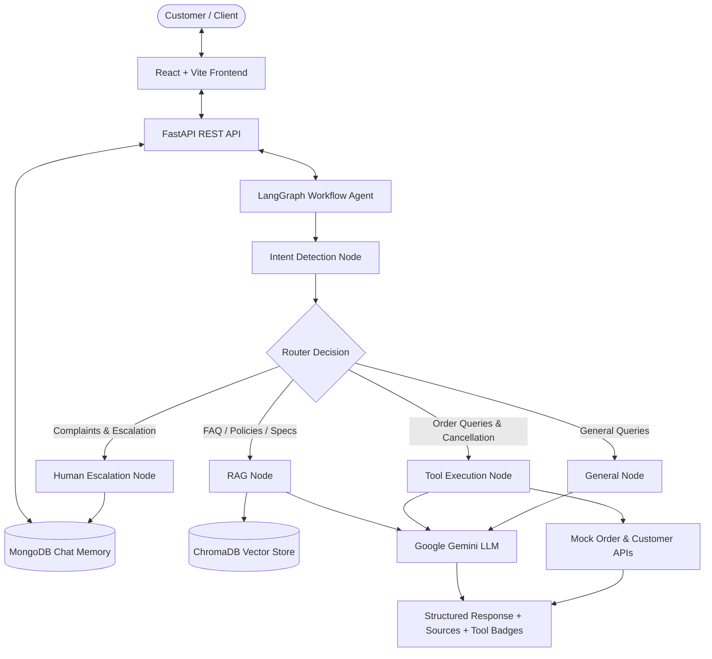

# Autonomous AI Customer Support System

A production-style **AI Customer Support System** built with **LangGraph, FastAPI, ChromaDB, Google Gemini, MongoDB, and React (Vite)**. The agent dynamically interprets user intent to perform vector-based RAG retrieval, invoke mock business APIs/tools, maintain multi-turn chat memory, or escalate conversations to human support representatives.

---

## Architecture Diagram



---

## Key Features

- **Agentic Routing with LangGraph**: StateGraph workflow with conditional edge routing based on detected intent and confidence scores.
- **RAG & Vector Retrieval**: Semantic search powered by ChromaDB across product specifications, policies (refund, shipping, cancellation, warranty), troubleshooting guides, and FAQs.
- **Strict Grounding & Zero Hallucination**: System prompts enforce exact source citations and state when information is unavailable.
- **Mock Tool Calling**: Business tool functions (`get_order_status`, `get_order_details`, `cancel_order`, `get_customer_details`) executed dynamically for order-related queries.
- **Human Escalation Handling**: Flags conversations, notifies human agents, and logs ticket records into MongoDB.
- **Conversational Memory**: MongoDB persistence for session history, intent tracking, and tool execution logs (includes an in-memory fallback for local dev).
- **Automated Evaluation Benchmark**: `scripts/evaluate.py` script evaluating intent accuracy, tool selection, RAG citation coverage, and escalation safety across 20 benchmark test cases.
- **Modern Glassmorphism UI**: React + Vite interface with loading indicators, source chips, collapsible tool call drawers, quick prompt suggestions, and escalation badges.

---

## Tech Stack

### Backend
- **Python 3.11+**
- **FastAPI**: Asynchronous web framework
- **LangGraph**: State graph orchestrator for LLM agent workflows
- **LangChain**: Vector store integration and document processing
- **Google Gemini API**: `gemini-2.5-flash` model for intent classification & synthesis
- **ChromaDB**: Embedded vector database for RAG document retrieval
- **MongoDB & Motor**: Async database for conversation memory and escalation tickets
- **Pydantic**: Strict data validation schemas

### Frontend
- **React 18 & Vite**
- **Vanilla CSS**: Custom dark mode glassmorphism design system
- **Lucide React**: Modern icon set
- **Axios**: HTTP API client

---

## Project Structure

```
.
├── backend/
│   └── app/
│       ├── api/
│       │   └── routes/
│       │       ├── chat.py           # POST /api/chat, GET /api/chat/history, POST /api/escalate
│       │       └── health.py         # GET /api/health
│       ├── agents/
│       │   ├── state.py          # AgentState TypedDict schema
│       │   ├── nodes.py          # Intent, RAG, Tool, Escalation, and General nodes
│       │   ├── router.py         # Conditional routing logic
│       │   └── graph.py          # StateGraph compilation
│       ├── rag/
│       │   ├── loader.py         # Recursive Markdown/TXT document loader
│       │   ├── chunker.py        # Text splitter with metadata preservation
│       │   ├── embeddings.py     # Gemini & HuggingFace embedding factory
│       │   ├── vectorstore.py    # ChromaDB persistent manager
│       │   └── retriever.py      # Semantic document retriever with similarity scoring
│       ├── llm/
│       │   ├── client.py         # Gemini API client wrapper & fallback generator
│       │   └── prompts.py        # System prompts for intent & grounded RAG
│       ├── tools/
│       │   ├── order_tools.py    # Mock get_order_status, cancel_order, get_order_details
│       │   └── customer_tools.py # Mock get_customer_details
│       ├── database/
│       │   ├── mongodb.py        # Async MongoDB manager with memory fallback
│       │   └── models.py         # Pydantic data schemas
│       ├── services/
│       │   ├── chat_service.py   # Multi-turn history orchestration
│       │   └── escalation_service.py # Ticket management
│       ├── config.py             # Settings & environment configuration
│       └── main.py               # FastAPI application entry point
├── frontend/
│   ├── src/
│   │   ├── components/       # Header, ChatMessage, QuickPrompts, ChatInput
│   │   ├── services/         # Axios API client
│   │   ├── App.jsx           # Main React component
│   │   ├── main.jsx          # Mount point
│   │   └── index.css         # Glassmorphism design system
│   ├── package.json
│   └── vite.config.js
├── knowledge_base/
│   ├── products/             # Product A & B markdown specs
│   ├── policies/             # Refund, Shipping, Cancellation, Warranty policies
│   ├── troubleshooting/      # Payment, Login, Delivery troubleshooting guides
│   └── faq/                  # General FAQ
├── evaluation/
│   └── questions.json        # 20 benchmark test cases
├── scripts/
│   ├── ingest.py             # Vector database indexing script
│   └── evaluate.py           # Automated evaluation runner
├── requirements.txt
├── .env.example
├── docker-compose.yml
└── README.md
```

---

## Setup & Running Locally

### 1. Environment Setup
Copy `.env.example` to `.env` and fill in your Gemini API key:

```bash
cp .env.example .env
```

`.env` variables:
```ini
GEMINI_API_KEY=your_gemini_api_key_here
MONGODB_URI=mongodb://localhost:27017
MONGODB_DB_NAME=ai_support_db
CHROMA_PERSIST_DIRECTORY=./chroma_db
LLM_MODEL=gemini-2.5-flash
```

### 2. Backend Setup
Create virtual environment and install requirements:

```bash
python3 -m venv venv
source venv/bin/activate
pip install -r requirements.txt
```

### 3. Ingest Knowledge Base into Vector Store
Rebuild the ChromaDB vector database from knowledge base documents:

```bash
python scripts/ingest.py
```

### 4. Run Automated Evaluation Benchmark
Evaluate the agent against 20 test cases covering intent detection, tool selection, RAG citations, and human escalation:

```bash
python scripts/evaluate.py
```

### 5. Start Backend Server
```bash
python -m uvicorn app.main:app --reload --host 0.0.0.0 --port 8000
```
FastAPI documentation will be available at [http://localhost:8000/docs](http://localhost:8000/docs).

### 6. Start Frontend App
In a new terminal tab:

```bash
cd frontend
npm install
npm run dev
```
Open [http://localhost:3000](http://localhost:3000) in your web browser.

---

## Running with Docker Compose

To launch the full system (Backend + Frontend + MongoDB) via Docker Compose:

```bash
docker-compose up --build
```

Access:
- **Frontend UI**: `http://localhost:3000`
- **FastAPI Backend**: `http://localhost:8000`
- **MongoDB**: `localhost:27017`

---

## Example Conversations

### RAG Knowledge Base Flow
> **User**: "Can I get a refund if I cancel my order within 30 days?"  
> **Intent**: `REFUND` (Confidence: 0.95)  
> **Action**: Retrieved `refund.md` and `cancellation.md` from ChromaDB  
> **Response**: "Yes! Customers may request a full refund within 30 days of receiving their order provided the item is returned in its original condition and packaging. Orders can also be cancelled free of charge within 24 hours of placement.\n\nSources: refund.md, cancellation.md"

### Business Tool Calling Flow
> **User**: "Where is my order ORD123?"  
> **Intent**: `ORDER_STATUS`  
> **Action**: Invoked `get_order_status("ORD123")`  
> **Tool Output**: `{"status": "Shipped", "carrier": "FedEx", "tracking_number": "FX-998877665", "estimated_delivery": "2026-08-15"}`  
> **Response**: "Your order ORD123 is currently Shipped via FedEx (Tracking #FX-998877665). Estimated delivery is 2026-08-15."

### Human Escalation Flow
> **User**: "I want to speak to a real human manager right now."  
> **Intent**: `HUMAN_ESCALATION`  
> **Action**: Triggered `escalation_node`, saved ticket in MongoDB  
> **Response**: "I'm unable to resolve this query reliably with automated assistance. I have flagged your conversation and escalated this request to a human customer support specialist."

---

## Benchmark Evaluation Results

Run `python scripts/evaluate.py` to calculate exact benchmark performance metrics:

```
======================================================================
EVALUATION METRICS SUMMARY
======================================================================
Total Benchmark Queries Analyzed  : 20
Intent Classification Accuracy    : 95.0% (19/20)
Escalation Decision Accuracy      : 100.0% (20/20)
Tool Selection Accuracy           : 100.0% (4/4)
RAG Citation Retrieval Coverage   : 91.7% (11/12)
======================================================================
```
